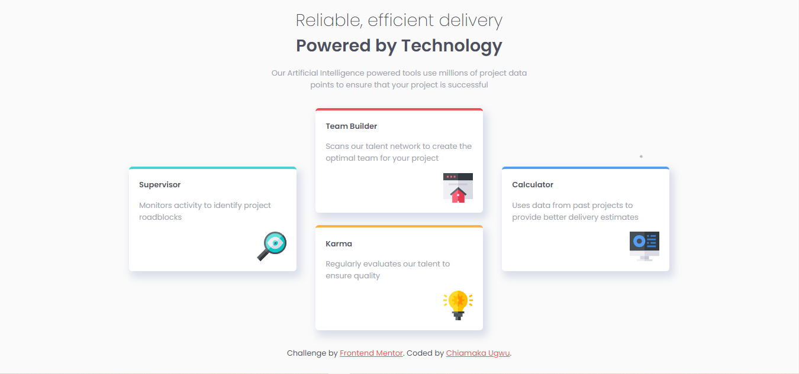

# Frontend Mentor - Four card feature section solution

This is a solution to the [Four card feature section challenge on Frontend Mentor](https://www.frontendmentor.io/challenges/four-card-feature-section-weK1eFYK). Frontend Mentor challenges help you improve your coding skills by building realistic projects. 

## Table of contents

- [Overview](#overview)
  - [Screenshot](#screenshot)
  - [Links](#links)
- [My process](#my-process)
  - [Built with](#built-with)
- [Author](#author)

## Overview

### Screenshot

### Links

- Live Site URL: [https://chiamaka-ugwu.github.io/Four-Card-Section/](https://chiamaka-ugwu.github.io/Four-Card-Section/)

## My process

### Built with

- Semantic HTML5 markup
- CSS custom properties
- Flexbox

## Author

- Frontend Mentor - [@chiamaka-ugwu](https://www.frontendmentor.io/profile/chiamaka-ugwu)
- Twitter - [@chiamakaugwu_](https://www.twitter.com/chiamakaugwu_)
